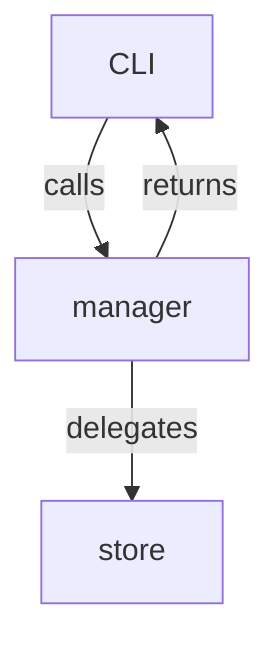

## Task 2 — Manager CRUD for Toolboxes

### 1  Why we need a "manager" layer

| Layer        | Responsibility                                                                    | Exists? |
| ------------ | --------------------------------------------------------------------------------- | ------- |
| **CLI / UI** | parse flags, pretty output                                                        | ✅       |
| **Manager**  | *Domain* logic — enforce invariants, raise domain errors, orchestrate store calls | **🚧**  |
| **Store**    | pure persistence (read/write JSON)                                                | ✅       |
| **Schema**   | data-only models, validation                                                      | ✅       |

Right now the CLI talks to `store` directly; any future UI (TUI, HTTP, notebook) would have to duplicate that logic.
The **manager layer** will give us a single, testable entry-point that:

* guards invariants (uniqueness, default-toolbox semantics, duplicate-tool names…)
* is agnostic of Click / printing
* raises *typed* exceptions instead of ClickExceptions

---

### 2  Success criteria

* Public API lives in **`llm_mcp/manager/toolboxes.py`**.
* All current BDD & unit tests still pass **after we refactor CLI to use the manager**.
* New unit-tests cover the manager functions directly (no Click runner).
* No regressions in type-checking (`mypy`) or lint.

---

### 3  Public API – first cut

```python
# llm_mcp/manager/errors.py
class ManagerError(Exception): ...

class ToolboxExists(ManagerError): ...
class ToolboxNotFound(ManagerError): ...
class ToolExists(ManagerError): ...
class ToolNotFound(ManagerError): ...
class DefaultToolboxNotSet(ManagerError): ...
```

```python
# llm_mcp/manager/toolboxes.py
from __future__ import annotations
from pathlib import Path
from typing import Iterable

from ..schema.toolboxes import ToolboxConfig, ToolRef
from .. import store
from .errors import *

# ────────────────────────────────────────────────────────────────────
# CRUD on toolboxes
# ────────────────────────────────────────────────────────────────────
def create(name: str, *, description: str | None = None) -> ToolboxConfig: ...
def remove(name: str) -> None: ...
def list() -> list[str]: ...
def get(name: str) -> ToolboxConfig: ...

# ────────────────────────────────────────────────────────────────────
# Tools inside a toolbox
# ────────────────────────────────────────────────────────────────────
def add_tool(tb_name: str, tool: ToolRef) -> ToolboxConfig: ...
def remove_tool(tb_name: str, public_name: str) -> ToolboxConfig: ...

# ────────────────────────────────────────────────────────────────────
# Default toolbox helpers
# (persistence lives in ~/.llm/mcp/default_toolbox.txt  for now)
# ────────────────────────────────────────────────────────────────────
def set_default(tb_name: str) -> None: ...
def clear_default() -> None: ...
def get_default() -> str | None: ...

# ────────────────────────────────────────────────────────────────────
# Validation (slow, optional)
# ────────────────────────────────────────────────────────────────────
def validate(tb_name: str) -> list[str]:
    """
    Returns list of *problems*.
    Empty list ⇒ valid.
    Only "light-weight" checks here (schema, duplicate names, server present);
    don't call remote MCP servers.
    """
```

*All functions must raise the **ManagerError** subclasses above instead of returning booleans.*

---

### 4  Internal flow



* Create / remove / list simply proxy to `store`, adding invariant checks.
* `add_tool`:

  1. load config
  2. check `public_name` collision (using helper from schema)
  3. append, `store.save_toolbox()`
* Default-toolbox helpers use `store.mcp_dir() / "default_toolbox.txt"` for now.

---

### 5  Refactor the CLI

* Replace all direct `store.*` calls in `cli/toolboxes.py` with manager calls.
* Substitute `click.ClickException` → catch `ManagerError` and re-raise as ClickException with friendly text.

Example:

```python
from llm_mcp.manager import toolboxes as mgr

try:
    mgr.create(name, description=description)
except mgr.ToolboxExists as e:
    raise click.ClickException(str(e)) from e
```

---

### 6  Tests to add (`tests/tdd/test_manager_toolboxes.py`)

| Scenario                       | Expected                       |
| ------------------------------ | ------------------------------ |
| `create` then `get`            | returns config w/ correct name |
| duplicate `create`             | raises `ToolboxExists`         |
| `add_tool` duplicate name      | `ToolExists`                   |
| `remove_tool` missing          | `ToolNotFound`                 |
| default toolbox round-trip     | `set_default → get_default`    |
| `validate` with missing server | returns list w/ error string   |

Use temp `LLM_USER_PATH` like existing tests.

---

### 7  Scaffold code (copy-paste)

```python
# llm_mcp/manager/__init__.py
from .toolboxes import *
```

```python
# llm_mcp/manager/errors.py
class ManagerError(Exception):
    """Base class for manager-level errors."""

class ToolboxExists(ManagerError): ...
class ToolboxNotFound(ManagerError): ...
class ToolExists(ManagerError): ...
class ToolNotFound(ManagerError): ...
class DefaultToolboxNotSet(ManagerError): ...
```

```python
# llm_mcp/manager/toolboxes.py
from __future__ import annotations
import os
from pathlib import Path
from typing import List

from ..schema.toolboxes import ToolboxConfig, ToolRef
from .. import store
from .errors import *

_DEFAULT_PATH = store.mcp_dir() / "default_toolbox.txt"

def _write_default(name: str | None) -> None:
    if name is None:
        _DEFAULT_PATH.unlink(missing_ok=True)
    else:
        _DEFAULT_PATH.write_text(name)

def _read_default() -> str | None:
    try:
        return _DEFAULT_PATH.read_text().strip()
    except FileNotFoundError:
        return None

# ───────── CRUD ────────────────────────────────────────────────────
def create(name: str, *, description: str | None = None) -> ToolboxConfig:
    if store.load_toolbox(name):
        raise ToolboxExists(f"Toolbox '{name}' already exists")
    cfg = ToolboxConfig(name=name, description=description)
    store.save_toolbox(cfg)
    return cfg

def remove(name: str) -> None:
    if not store.remove_toolbox(name):
        raise ToolboxNotFound(f"Toolbox '{name}' not found")
    # clear default if it pointed to this one
    if _read_default() == name:
        _write_default(None)

def list() -> List[str]:
    return store.list_toolboxes()

def get(name: str) -> ToolboxConfig:
    cfg = store.load_toolbox(name)
    if cfg is None:
        raise ToolboxNotFound(f"Toolbox '{name}' not found")
    return cfg

# ───────── Tools inside a toolbox ──────────────────────────────────
def add_tool(tb_name: str, tool: ToolRef) -> ToolboxConfig:
    cfg = get(tb_name)
    public_name = (
        tool.name
        or getattr(tool, "tool", None)
        or getattr(tool, "attr", None)
        or getattr(tool, "method", None)
    )
    if public_name is None:
        raise ValueError("Cannot determine public name for tool")
    if any(
        (
            public_name == (t.name or getattr(t, "tool", None)
                            or getattr(t, "attr", None)
                            or getattr(t, "method", None))
        ) for t in cfg.tools
    ):
        raise ToolExists(f"Tool '{public_name}' already exists in '{tb_name}'")
    cfg.tools.append(tool)
    store.save_toolbox(cfg)
    return cfg

def remove_tool(tb_name: str, public_name: str) -> ToolboxConfig:
    cfg = get(tb_name)
    new_tools = [
        t for t in cfg.tools
        if public_name != (
            t.name or getattr(t, "tool", None)
            or getattr(t, "attr", None) or getattr(t, "method", None)
        )
    ]
    if len(new_tools) == len(cfg.tools):
        raise ToolNotFound(f"Tool '{public_name}' not found in '{tb_name}'")
    cfg.tools = new_tools
    store.save_toolbox(cfg)
    return cfg

# ───────── Default toolbox helpers ─────────────────────────────────
def set_default(tb_name: str) -> None:
    get(tb_name)   # ensure it exists
    _write_default(tb_name)

def clear_default() -> None:
    _write_default(None)

def get_default() -> str | None:
    return _read_default()

# ───────── Validation ─────────────────────────────────────────────
def validate(tb_name: str) -> List[str]:
    cfg = get(tb_name)
    problems: List[str] = []

    # 1. duplicate names inside toolbox (should not happen, schema prevents)
    seen: set[str] = set()
    for t in cfg.tools:
        n = t.name or getattr(t, "tool", None) or getattr(t, "attr", None) or getattr(t, "method", None)
        if n in seen:
            problems.append(f"Duplicate tool name '{n}'")
        seen.add(n)

    # 2. referenced server exists
    from .. import store as _s
    servers = set(_s.list_servers())
    for t in cfg.tools:
        if isinstance(t, ToolRef.__metadata__["inner_types"][0]):  # MCPToolRef
            if t.server not in servers:
                problems.append(f"Server '{t.server}' not found")

    return problems
```

*(The mini-reflection trick for `isinstance` on the union can be replaced with `from ..schema.toolboxes import MCPToolRef` if you'd rather.)*

---

### 8  Migration checklist

1. **Add new package modules** (`manager/…`) & update `__init__.py`.
2. Update imports in CLI / builder layers.
3. Insert new `tests/tdd/test_manager_toolboxes.py`.
4. `make test` → green.
5. Update docs / README to refer to snake-case toolbox names & new manager API.

That should cover Task 2 end-to-end.
Ping me if you'd like code review once the first PR is up!
